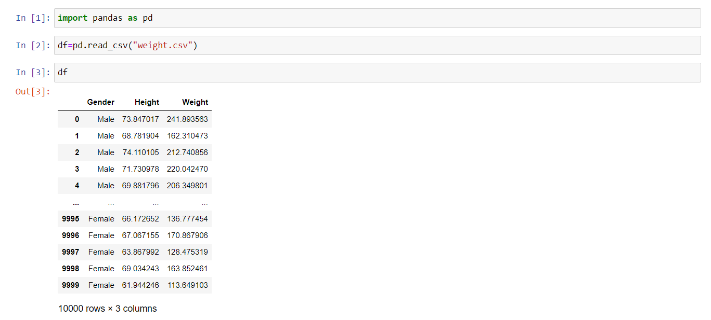
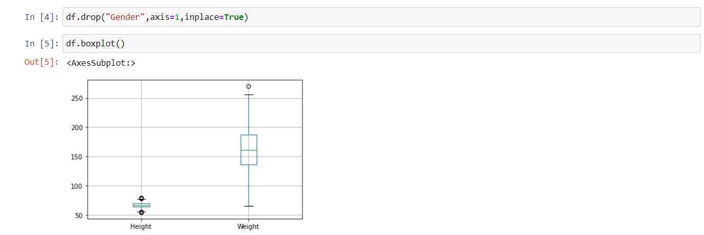
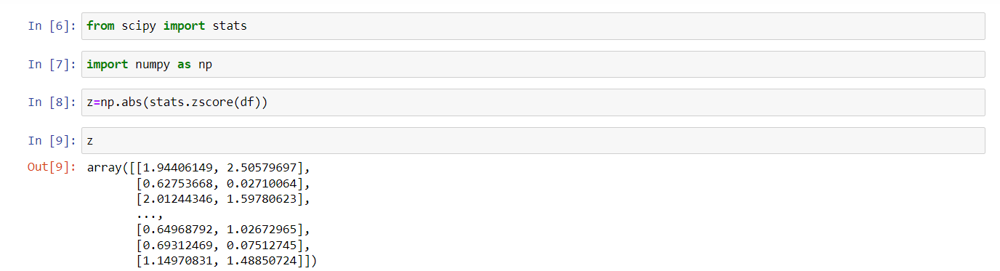
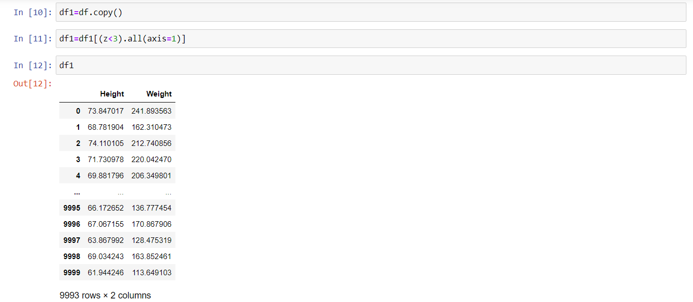
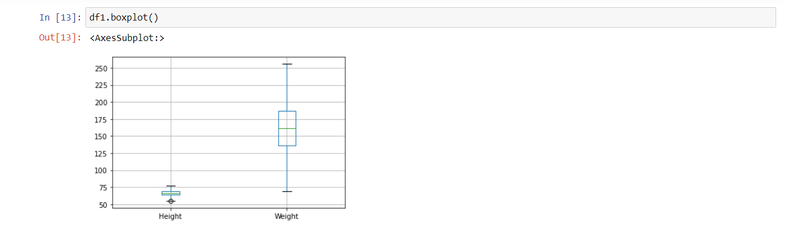
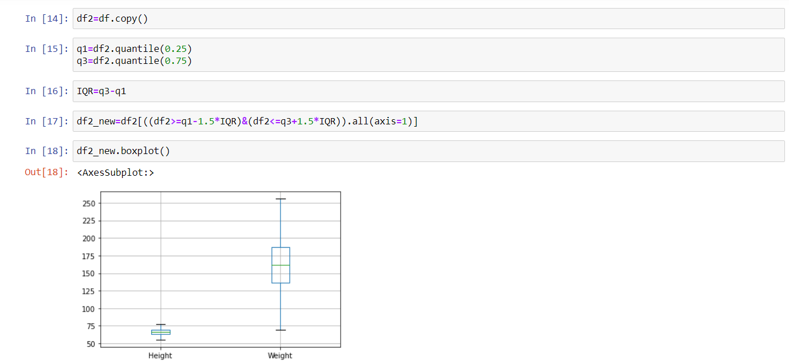
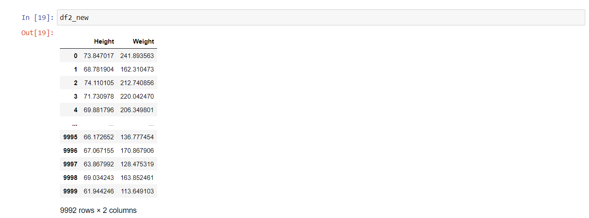

# EX-02 OUTLIER DETECTION AND REMOVAL

## AIM:
To read the given data and detect outliers and remove them.

## EXPLANATION:
An outlier is an observation that lies an abnormal distance from other values in a random sample from a population.These outliers can be removed using Z-score method and IQR-score method.Some outliers can be useful too, like detecting the rare disease in the population.

## ALGORITHM:
### STEP 1:
Read the given data.
## STEP 2:
Apply boxplot to analyze the outliers of given data.
### STEP 3:
Use Z-score method to remove outliers.
### STEP 4:
Use IQR score method to remove outliers that lies below or above the range.

## CODE:
```
import pandas as pd
df=pd.read_csv("weight.csv")
df
df.drop("Gender",axis=1,inplace=True)
df.boxplot()
from scipy import stats
import numpy as np
z=np.abs(stats.zscore(df))
z
df1=df.copy()
df1=df1[(z<3).all(axis=1)]
df1
df1.boxplot()
df2=df.copy()
q1=df2.quantile(0.25)
q3=df2.quantile(0.75)
IQR=q3-q1
df2_new=df2[((df2>=q1-1.5*IQR)&(df2<=q3+1.5*IQR)).all(axis=1)]
df2_new.boxplot()
df2_new
```
## OUTPUT:
### READING THE DATA

### BOXPLOT METHOD TO REPRESENT OUTLIERS

### REMOVING OUTLIERS USING Z-SCORE METHOD



### REMOVING OUTLIERS USING IQR METHOD



## RESULT:
Hence the given data is read and the outliers are removed.